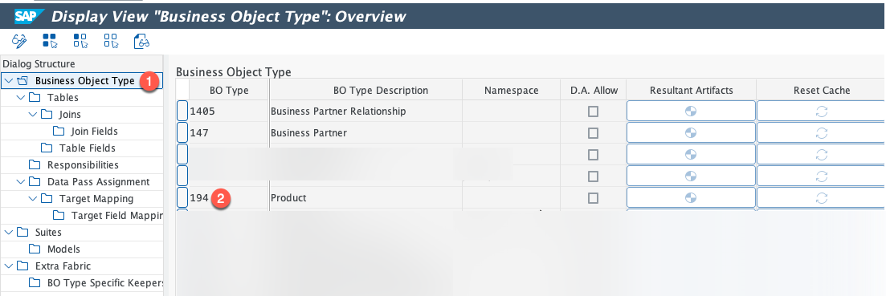
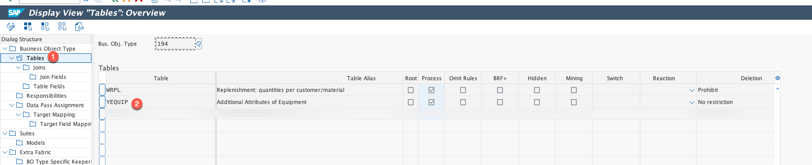
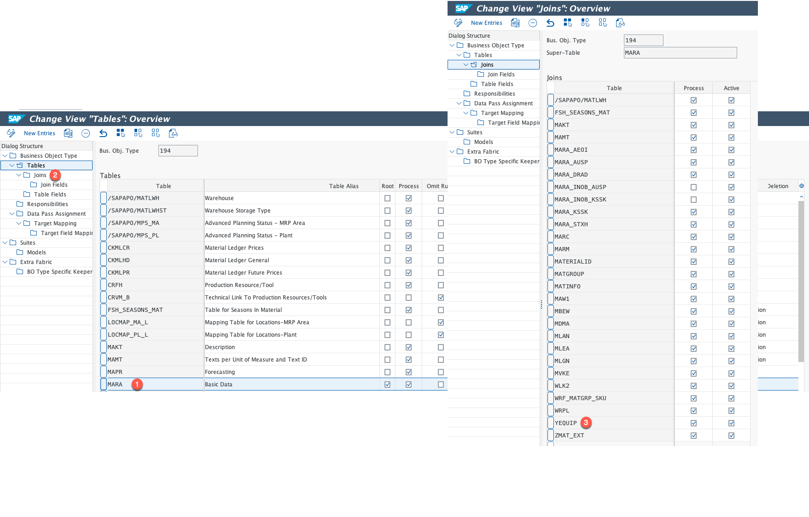
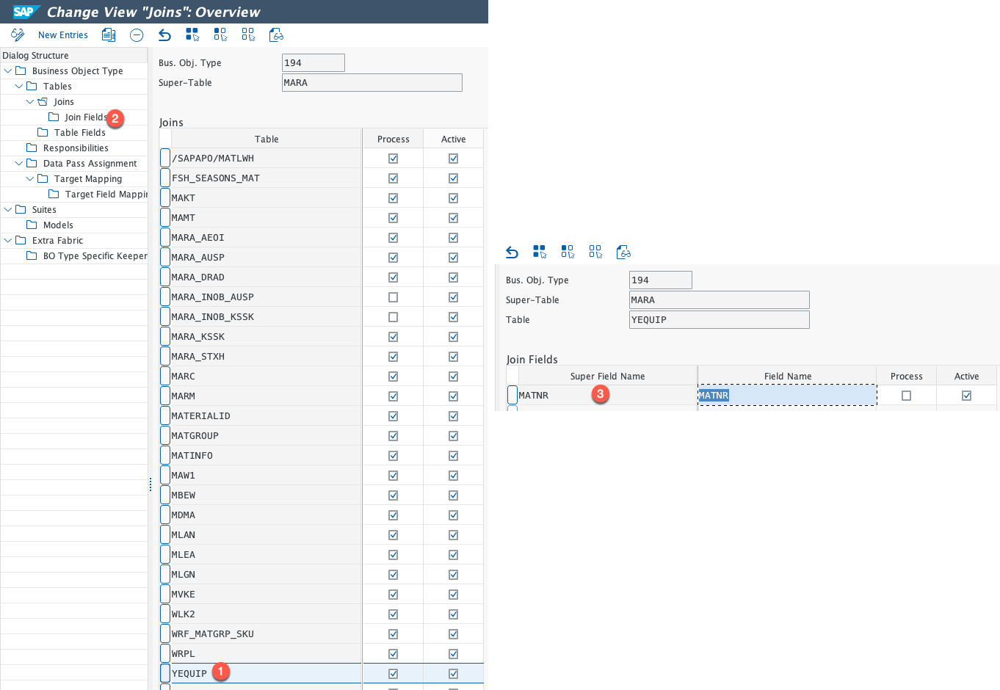
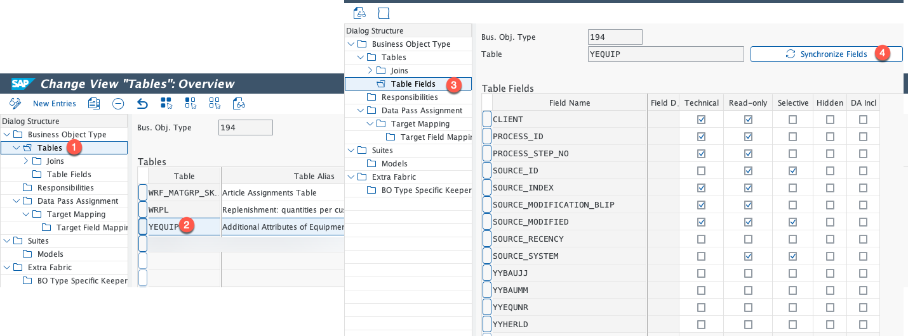
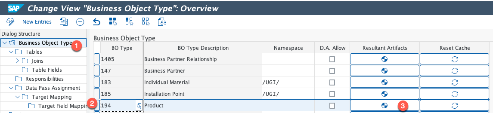
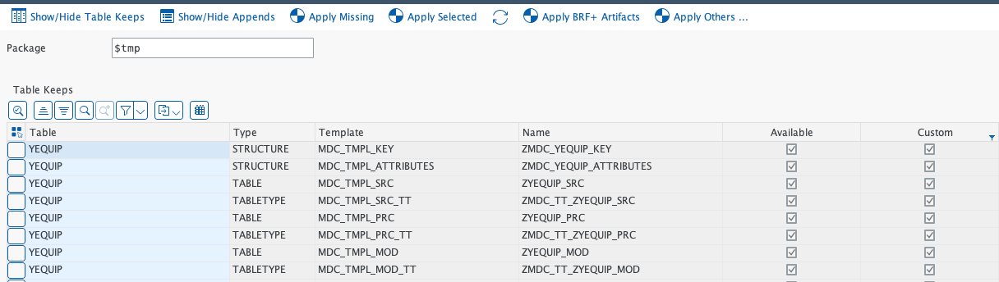
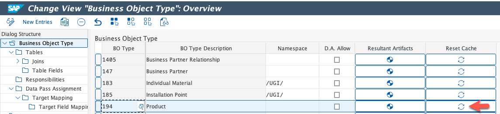

# Extending CMP Data Model with custom node

The **persistence layer** in _Cloud‑Ready Mode_ is based on the **Consolidation and Mass Processing (CMP) framework**. In practical terms, this means that once the [save sequence](https://help.sap.com/docs/abap-cloud/abap-rap/rap-transactional-model-and-sap-luw) is executed, the draft data is persisted into the **CMP process tables**.

Therefore, to support Node extension, it is essential to **extend the CMP data model with a custom node**.

This document describes the **end‑to‑end steps** required to implement a **node extension** for the CMP data model, ensuring compatibility with the RAP transactional model and adherence to **SAP Cloud‑Ready** and **Clean Core** principles.

---

## Quick Navigation

- [Prerequisites](#prerequisites)
- [Step 1: Create the Database Table](#step-1-create-the-database-table)
- [Step 2: Add the Table to the CMP Data Model](#step-2-add-the-table-to-the-cmp-data-model)
- [Step 3: Generate Resultant Artifacts](#step-3-generate-resultant-artifacts)
- [Create or Extend ZCL_MDC_MODEL_MAT](#create-or-extend-zcl_mdc_model_mat)
- [Implementation of BAdI CMD_PRODUCT_SEGMENTS_EXT](#implementation-of-badi-cmd_product_segments_ext)

## Prerequisites

- Access to SAP MDG IMG configuration for Cloud-Ready Mode
- Authorization to maintain process models and generate resultant artifacts
- A package available for artifact generation
- Existing product process model (`Business Object Type 194`)

## Create the Data Dictionary Table Representing the Node Extension

### Step 1: Create the Database Table

Create a database table named **YEQUIP** using the information provided below.

#### Table Information

| Field Name  | Key | Data Type | Length | Description           |
| ----------- | --- | --------- | ------ | --------------------- |
| **MATNR**   | Yes | CHAR      | 40     | Material Number       |
| **YYEQUNR** | Yes | CHAR      | 18     | Equipment Number      |
| YYBAUJJ     | No  | CHAR      | 04     | Fiscal year (text)    |
| YYBAUMM     | No  | CHAR      | 02     | Month of construction |
| YYHERLD     | No  | CHAR      | 03     | Country key           |

#### Table Definition (ABAP)

```abap
@EndUserText.label            : 'Additional Data for Equipment'
@AbapCatalog.enhancement.category : #NOT_EXTENSIBLE
@AbapCatalog.tableCategory   : #TRANSPARENT
@AbapCatalog.deliveryClass   : #A
@AbapCatalog.dataMaintenance : #RESTRICTED
define table yequip {

  key client  : mandt not null;
  key matnr   : matnr not null;
  key yyequnr : equnr not null;

  yybaujj : cjahr;
  yybaumm : baumm;
}
```

### Step 2: Add the Table to the CMP Data Model

1. Add the table **YEQUIP** to the CMP data model
   1. Go to transaction `MDGIMG->Cloud-Ready Mode in SAP MDG->Configure Process Models and Field Properties->Configure Process Models`

   2. In the dialog Structure section click on the `Business Object Type` and select `194(Product)`
      
        Figure 1: Select Business Object Type `194 (Product)`.

   3. Select `Tables` in the Dialog Structure view

   4. Click on `New Entries` and the details as shown below
      
        Figure 2: Create a new table entry for `YEQUIP`.

   5. Select the root table `MARA` and `Joins` in dialog structure view and maintain the details as shown below
      
        Figure 3: Maintain join settings for root table `MARA`.

   6. Select the newly created entry table `YEQUIP` and click on `Join Fields` and values as shown below
      
        Figure 4: Maintain join fields for `YEQUIP`.

   7. Select `Tables` in dialog structure, select `YEQUIP` table, select `Table Fields` in the dialog structure and click on `Synchronize Fields`
      
        Figure 5: Synchronize table fields.

   8. Click on `Save` button

### Step 3: Generate Resultant Artifacts

   This step is required all the artifacts like process tables. This artifacts will be used by the framework during the runtime.

   1. Go to transaction `MDGIMG->Cloud-Ready Mode in SAP MDG->Configure Process Models and Field Properties->Configure Process Models`

   2. Click on `Business Object Type` on the dialog structure, select BO Type `194` and click on `Resultant Artifacts`
      
        Figure 6: Open Resultant Artifacts for BO Type `194`.

   3. Enter a value in `Package` field, and click on `Apply missing`, after processing is completed, system will show the generated artifacts, as shown below
      
        Figure 7: Apply missing artifacts and review generated output.

   4. Click on the `Reset Cache` button

      
        Figure 8: Reset cache after generation.

## Create or Extend ZCL_MDC_MODEL_MAT

### Class: `ZCL_MDC_MODEL_MAT`

| Method                       | Type               | Description                                                        |
| :--------------------------- | :----------------- | :----------------------------------------------------------------- |
| `MAP_EXTENSIONS_2API`        | Protected Instance | Maps the data from PRC table format to unified material API format |
| `CALL_API_EXTENSION_PREPARE` | Protected Instance | Map to Unified API format                                          |

> ⚠️ **Caution:** The following code is for illustrative purpose only.

{: .line-numbers}
```abap
    CLASS zcl_mdc_model_mat DEFINITION
    PUBLIC
    INHERITING FROM cl_mdc_model_mat
    CREATE PROTECTED

    GLOBAL FRIENDS if_mdc_model .

    PUBLIC SECTION.
    PROTECTED SECTION.


        METHODS map_extensions_2api
            REDEFINITION .
        METHODS call_api_extension_prepare REDEFINITION.
    PRIVATE SECTION.

        DATA mr_zmat_ext_prc TYPE REF TO zmdc_tt_zzmat_ext_prc .
        DATA mr_zmaw1_prc TYPE REF TO zmdc_tt_zzmaw1_prc .
        DATA mr_yequip_prc TYPE REF TO zmdc_tt_zyequip_prc.
        DATA sorted TYPE abap_bool.
        CONSTANTS mv_equiptable TYPE tabname VALUE 'YEQUIP'.
        DATA deleted_records TYPE REF TO zmdc_tt_zyequip_prc.
        METHODS get_deleted_records.
    ENDCLASS.
    CLASS zcl_mdc_model_mat IMPLEMENTATION.
    METHOD map_extensions_2api.

        IF NOT me->sorted EQ abap_true.
        SORT me->mr_yequip_prc->* BY process_key.
        me->sorted = abap_true.
        me->get_deleted_records(  ).
        ENDIF.
        LOOP AT me->mr_yequip_prc->* ASSIGNING FIELD-SYMBOL(<ls_rec>) WHERE process_id = is_mat_prc-process_id AND process_step_no =
                is_mat_prc-process_step_no AND source_system = is_mat_prc-source_system AND source_id = is_mat_prc-source_id.

        cs_mat_data-zzequip_ext_t = VALUE #( BASE cs_mat_data-zzequip_ext_t ( product             = iv_matnr
                                                                                fiscalyearastext    = <ls_rec>-yybaujj
                                                                                monthofconstruction = <ls_rec>-yybaumm
                                                                                equipmentnumber     = <ls_rec>-yyequnr
                                                                                countrykey          = <ls_rec>-yyherld
                                            ) ).
        ENDLOOP.
        LOOP AT deleted_records->* ASSIGNING FIELD-SYMBOL(<ls_delete>) WHERE source_id = iv_matnr .
        cs_mat_data-zzequip_ext_t = VALUE #( BASE cs_mat_data-zzequip_ext_t ( product             = iv_matnr
                                                                                fiscalyearastext    = <ls_delete>-yybaujj
                                                                                monthofconstruction = <ls_delete>-yybaumm
                                                                                equipmentnumber     = <ls_delete>-yyequnr
                                                                                countrykey          = <ls_delete>-yyherld
                                                                                delete_row          = abap_true
                                            ) ).
        ENDLOOP.
    ENDMETHOD.
    METHOD get_deleted_records.
        TRY.
            DATA(model) = cl_mdc_model=>new( iv_process_id = me->process_id iv_bo_type = me->bo_type ). "no step number
            DATA(bridge) = cl_mdc_sql_bridge=>get( model = model ).
            DATA(object) = model->object( iv_table_name = mv_equiptable ).
            DATA(table_name) = object->table_name_by_type( iv_type = if_mdc_data=>gc_type-process ).
            DATA records TYPE REF TO data.
            CREATE DATA records TYPE STANDARD TABLE OF (table_name).
            TRY.
                CREATE DATA deleted_records TYPE  zmdc_tt_zyequip_prc.
                ASSIGN deleted_records->* TO FIELD-SYMBOL(<lt_deleted_rec>).
                CHECK <lt_deleted_rec> IS ASSIGNED.
                DATA(select) = bridge->kpi_deleted_records_select( io_data = object ).
                DATA(corresponding_fields) = bridge->add_all_columns_of_object( io_select = select io_data = object ).
                select->execute( results_ref = records  corresponding_fields = CONV #( corresponding_fields )  intercepted = abap_true ).
                LOOP AT records->* ASSIGNING FIELD-SYMBOL(<ls_rec>).
                <lt_deleted_rec> = VALUE #( BASE <lt_deleted_rec> ( CORRESPONDING #( <ls_rec> ) ) ).

                ENDLOOP.
            CATCH cx_sql_exception cx_mdc_sql INTO DATA(sql_exc).
                me->log->add_exception_text(
                io_exception     = sql_exc
                iv_message_type  = if_mdc_log_constants=>message_type-yellow
                iv_problem_class = if_mdc_log_constants=>problem_class-medium
                ).
            ENDTRY.
        CATCH cx_mdc_model.
            "handle exception
        ENDTRY.
    ENDMETHOD.

    METHOD call_api_extension_prepare.
        DATA : lt_equipment TYPE TABLE FOR READ RESULT zi_productequipmentaddnlgovtp.
        cs_mat_data-zzequip_ext_t = VALUE #( BASE cs_mat_data-zzequip_ext_t FOR i IN is_mat_data-zzequip_ext_t (
                                            CORRESPONDING #( i MAPPING product = DEFAULT iv_matnr ) ) ).


        cs_mat_data-zzequip_ext_t_x = VALUE #( BASE cs_mat_data-zzequip_ext_t_x FOR wa IN is_mat_data-zzequip_ext_t_x ( CORRESPONDING #( wa MAPPING matnr = DEFAULT iv_matnr ) ) ).
    ENDMETHOD.
    ENDCLASS.
```

### Implementation of BAdI CMD_PRODUCT_SEGMENTS_EXT

The BAdI **CMD_PRODUCT_SEGMENTS_EXT** must be implemented to save data into the node extension database table.

> ⚠️ **Important:** The specific steps to implement this BAdI are currently out of scope for this documentation.
